<h1 align="center">Oneomatic :calling: :right_anger_bubble:</h1> 
---
<p align="center">

</p>
<p align="center">

</p>
<p align="center">

</p>
<hr>
<h2> Overview :scroll: </h2> <br>
 * An Android  application ‘Oneomatic’ focuses on Assisting Needy and Aged. :older_man: <br>
 * It is a App that provides user especially the elderly(old age) with an all-in-one functionality,so that it would be easy for them to use multiple features in single Application.<br>
 * It is an Application that consists of Four applications in one with strong Authentication functionality using Firebase Authentication.<br>
<hr>
<h4> Application provided by Oneomatic are:- </h4>
1) Pedometer : Step Counter Application <br>
2) Oxymeter : Oxygen level Calculation Application <br>
3) Medominder : Medicine Reminder Application <br>
4) Translate Plus : Translator Application <br>
<hr>
<h2> Pre-requisites </h2>
<p>In order to use the applications, you must have the following installed:</p>

* Android Studio <br>
* Android SDK version 29 <br>
* JDK8 <br>
* Emulator or Android device <br>
* Register Project to [Firebase Console](https://console.firebase.google.com/) with Package name <br>
* Download google-services.json <br>
<hr>
<h2> How To Use 🔧 </h2>

From your command line:

```bash

# Clone this repository in Git Bash
$ git clone https://github.com/TechieMeSB/AndroidProject.git

# Go into the repository
$ cd AndroidProject
```

<hr>
<h2>Screenshots</h2>
<div>
  
  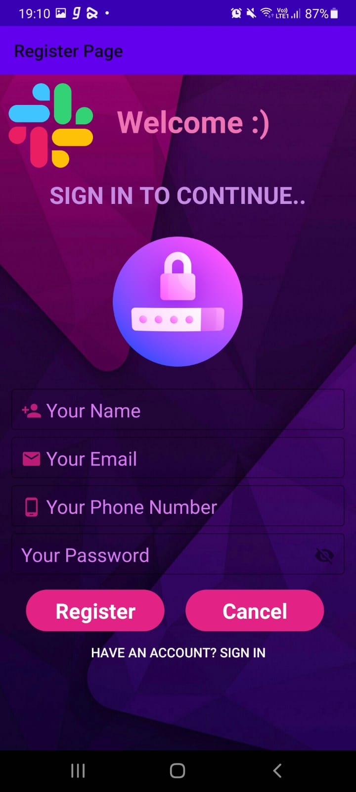
  
</div>
<br>
<h3>Authentication</h3>
<div >
  
  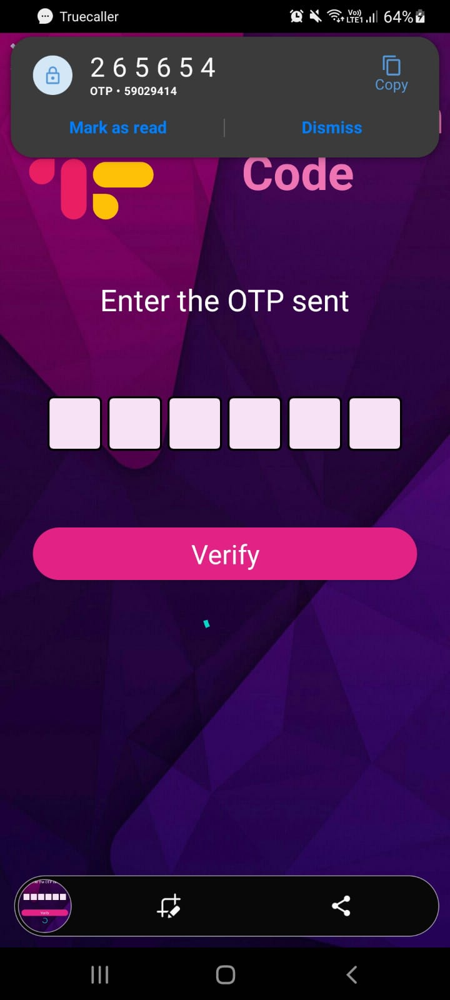
  
  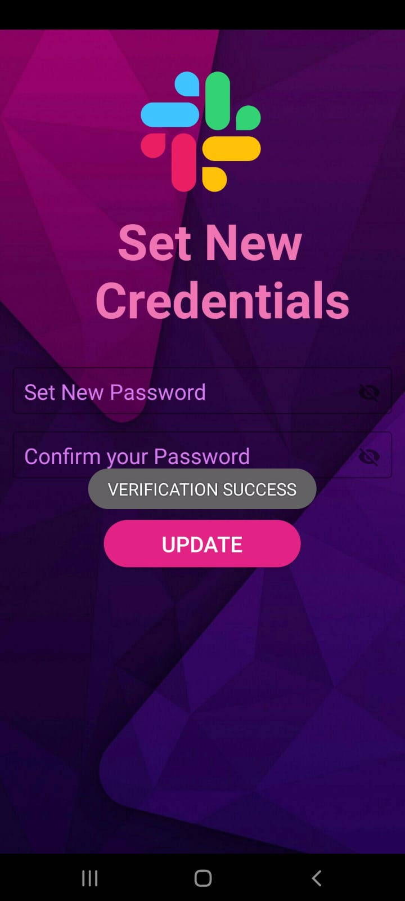
</div>
<br>
<h3>Dashboard</h3>
<div > 
  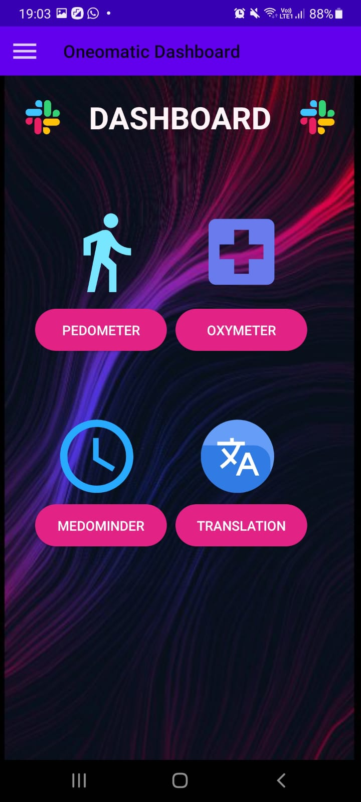
  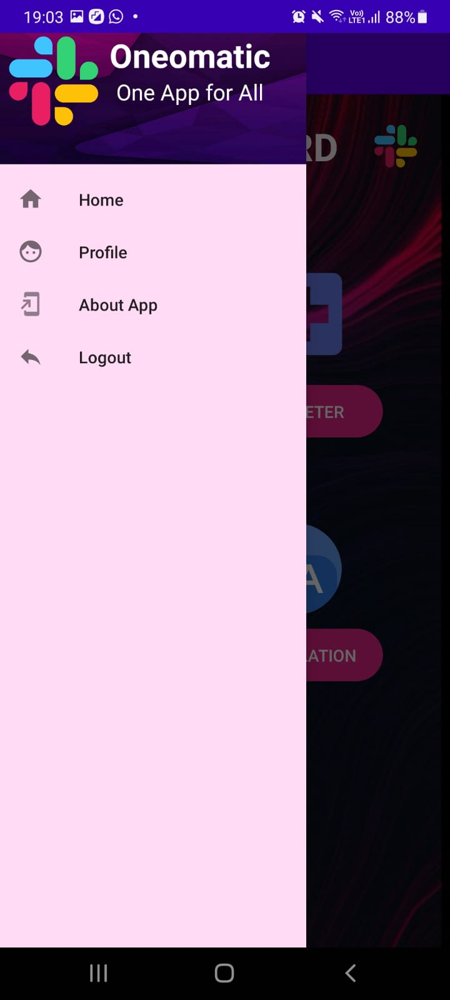
  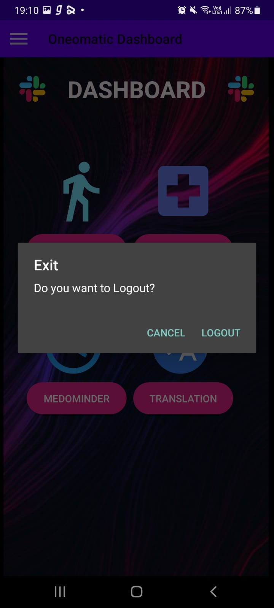
</div>
<br>
<h3>Pedometer</h3>
<div>
  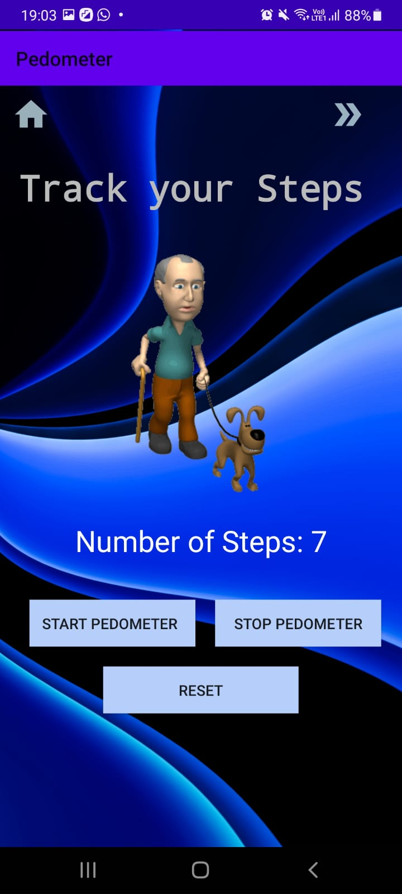
</div>
<br>
<h3>Oxymeter</h3>
<div > 
  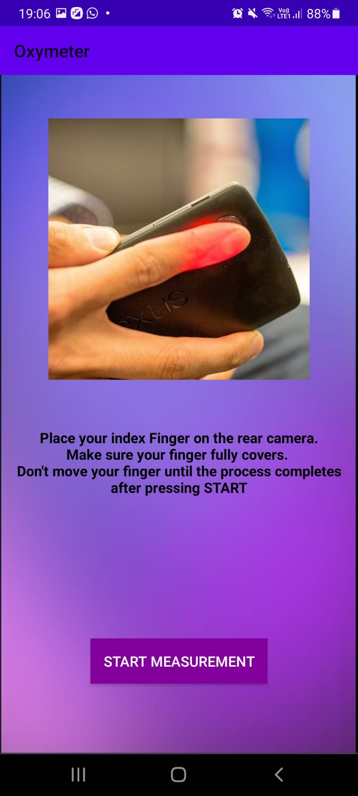
  
  
</div>
<br>
<h3>Medominder</h3>
<div>
  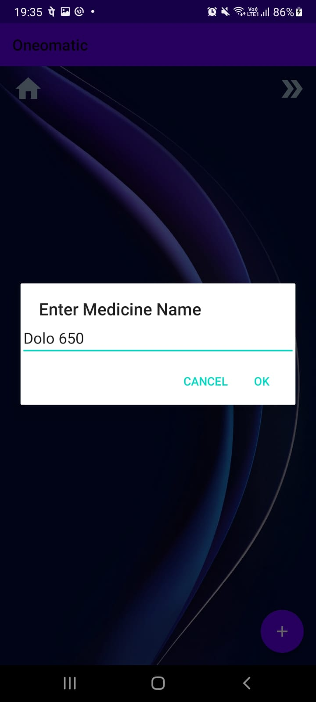
  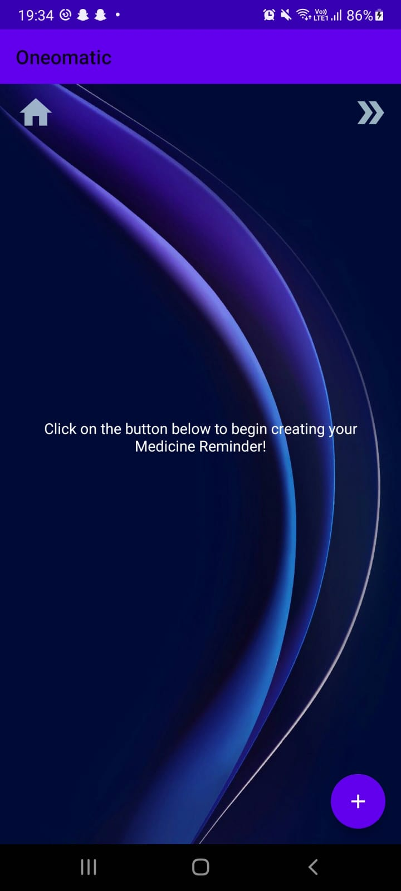
  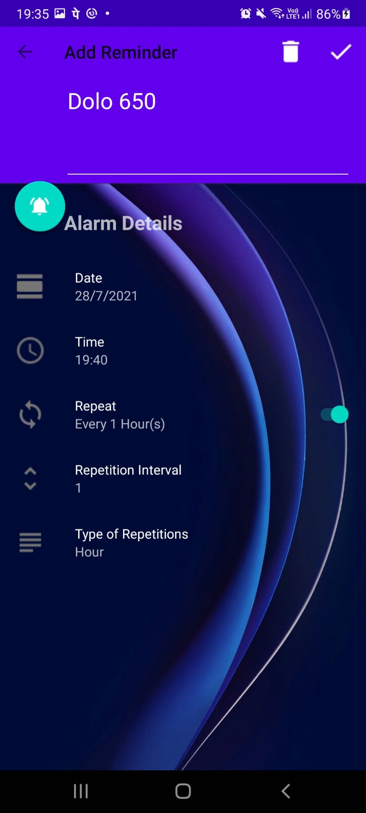
  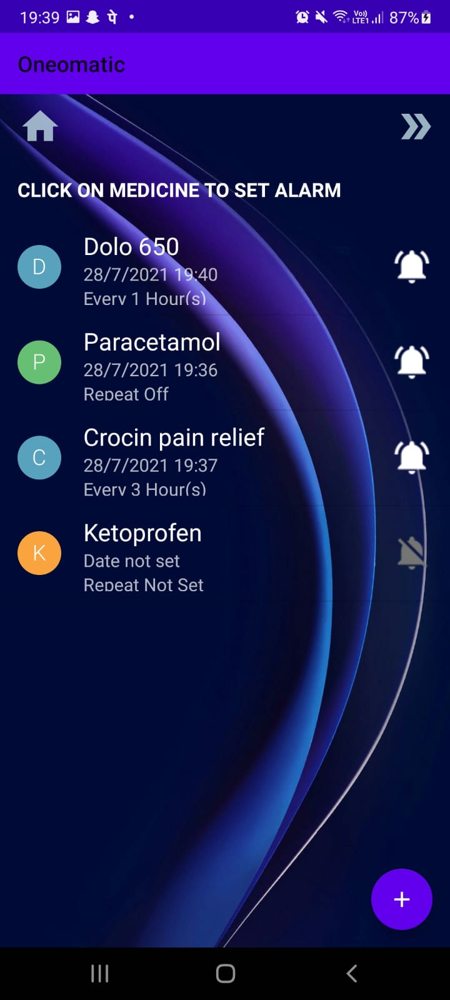
</div>
<br>
<h3>Translation</h3>
<div > 
  
  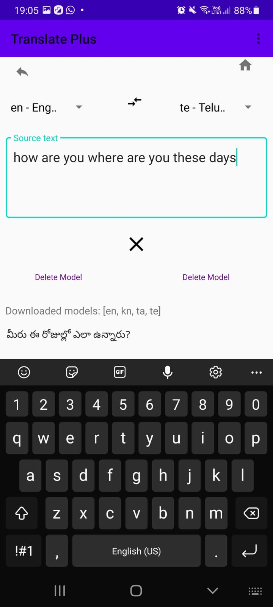
</div>


